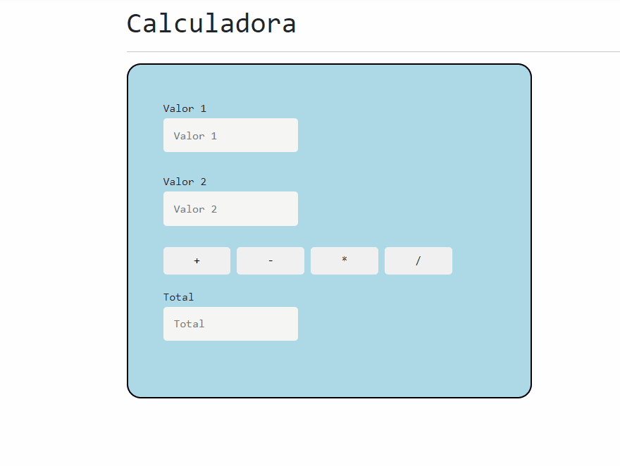

---
# MVC Project
This repository contains a project that I completed during my training at Abase Sistemas. The project's goal was to introduce the fundamental concepts of the MVC (Model-View-Controller) design pattern and understand the data transmission principles between the front-end and the back-end.

## Overview
During the training, we focused on implementing the MVC pattern in C#. As a hands-on exercise, we developed a mini calculator which takes input values from the user on the front-end, passes them to the back-end for data processing, and returns the results to the front-end. The GIF below showcases the functionality of this calculator:

## Technologies Used
- C#

Feel free to explore this repository to get a better understanding of how the MVC pattern can be implemented in a simple C# application, and how data transmission between the front-end and the back-end works.

---
# Projeto MVC
Este repositório contém um projeto que completei durante meu treinamento na Abase Sistemas. O objetivo do projeto era apresentar conceitos iniciais para a compreensão do padrão de design MVC (Model-View-Controller) e compreender os conceitos de transmissão de dados entre o front-end e o back-end.

## Visão geral
Durante o treinamento, nos concentramos na implementação do padrão MVC em C#. Como um exercício prático, desenvolvemos uma mini calculadora. A qual recebe os valores digitados pelo usuário no front-end e repasse para o back-end, onde há o processamento de dados e o retorno para o front-end. O GIF abaixo mostra a funcionalidade desta calculadora:

## Tecnologias usadas
- C#

Sinta-se à vontade para explorar o repositório para entender melhor como o padrão MVC pode ser implementado em uma simples aplicação em C#, e como ocorre a transmissão de dados entre o front-end e o back-end.

---
